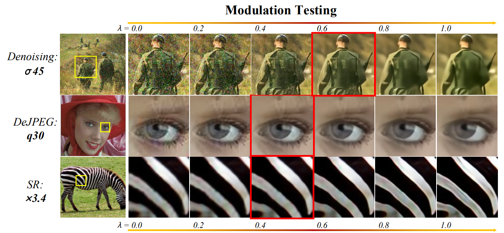

# AdaFM [paper](https://arxiv.org/abs/1904.08118)

  

  

### BibTex

    @misc{he2019modulating,
    title={Modulating Image Restoration with Continual Levels via Adaptive Feature Modification Layers},
    author={Jingwen He and Chao Dong and Yu Qiao},
    year={2019},
    eprint={1904.08118},
    archivePrefix={arXiv},
    primaryClass={cs.CV}
    }
    
## Table of Contents
1. [Dependencies](#dependencies)
1. [Codes](#codes)
1. [Usage](#usage)
1. [Pretrained models](#pretrained-models)

### Dependencies

- Python 3 (Recommend to use [Anaconda](https://www.anaconda.com/download/#linux))
- [PyTorch >= 0.4.0](https://pytorch.org/)
- NVIDIA GPU + [CUDA](https://developer.nvidia.com/cuda-downloads)
- Python packages: `pip install numpy opencv-python lmdb`
- [option] Python packages: [`pip install tensorboardX`](https://github.com/lanpa/tensorboardX), for visualizing curves.

# Codes
The overall code framework mainly consists of four parts - Config, Data, Model and Network.
We also provides some useful scripts. More details in [`./codes/scripts`](https://github.com/xinntao/BasicSR/tree/master/codes/scripts). 

## How to Test

### basic model and AdaFM-Net
1. Modify the configuration file `options/test/test_sr.json` 
1. Run command: `python test.py -opt options/test/test_sr.json`

### modulation testing
1. Modify the configuration file `options/test/iterpolation.json` 
1. Run command: `python interpolate.py -opt options/test/iterpolation.json`

## How to Train

### basic model
1. Prepare datasets, usually the DIV2K dataset. More details are in [`codes/data`](https://github.com/xinntao/BasicSR/tree/master/codes/data). 
1. Modify the configuration file `options/train/train_basic.json`
1. Run command: `python train.py -opt options/train/train_basic.json`

### AdaFM-Net
1. Prepare datasets, usually the DIV2K dataset.
1. Modify the configuration file `options/train/train_adafm.json`
1. Run command: `python train.py -opt options/train/train_adafm.json`

# Pretrained models
We provide some pretrained models. More details about the pretrained models, please see [`experiments/pretrained_models`](https://github.com/xinntao/BasicSR/tree/master/experiments/pretrained_models).

You can put the downloaded models in the `experiments/pretrained_models` folder.

<table>
  <tr>
    <th>Task</th>
    <th>Models</th>
    <th>Short Description</th>
    <th>Google Drive</th>
    <th>Baidu Drive</th>
  </tr>
  <tr>
    <th rowspan="2">Denoise</th>
    <td>noise15_basic_model.pth</td>
    <td>basic model deals with noise 15</td>
    <td rowspan="2"><a href="https://drive.google.com/drive/u/0/folders/17VYV_SoZZesU6mbxz2dMAIccSSlqLecY">Google Drive</a></td>
    <td rowspan="2"><a href="https://pan.baidu.com/s/1-Lh6ma-wXzfH8NqeBtPaFQ)">Baidu Drive</a></td>
  </tr>
  <tr>
    <td>noise75_adafm_net.pth</td>
    <td>AdaFM-Net deals with noise 75</td>
  </tr>
   
  <tr>
    <th rowspan="2">DeJPEG</th>
    <td>q80_basic_model.pth</td>
     <td>basic model deals with q80</td>
    <td rowspan="2"><a href="https://drive.google.com/drive/folders/1WR2X4_gwiQ9REb5fHfNnBfXOdeuDS8BA?usp=sharing">Google Drive</a></td>
    <td rowspan="2"><a href="">Baidu Drive</a></td>
  </tr>
  <tr>
    <td>q10_adafm_net.pth</td>
    <td>AdaFM-Net deals with q10</td>
  </tr>
  
  <tr>
    <th rowspan="2">SR</th>
    <td>x3_basic_model.pth</td>
     <td>basic model deals with x3</td>
    <td rowspan="2"><a href="https://drive.google.com/drive/folders/1WR2X4_gwiQ9REb5fHfNnBfXOdeuDS8BA?usp=sharing">Google Drive</a></td>
    <td rowspan="2"><a href="">Baidu Drive</a></td>
  </tr>
  <tr>
    <td>x4_adafm_net.pth</td>
    <td>AdaFM-Net deals with x4</td>
  </tr>
</table>

## Acknowledgement

- The code is based on [BasicSR](https://github.com/xinntao/BasicSR) framework.
